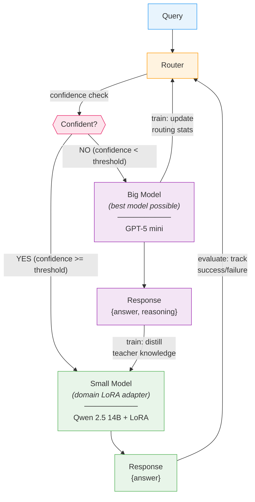
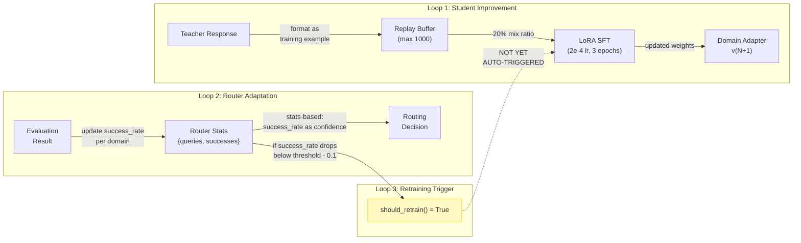

# Project Vision: Adaptive Teacher-Student Routing with Online Learning

## Core Research Question

> "When we route, why don't we use the answer from the large model to improve the smaller model?"

**The goal is domain-agnostic online distillation.** The small model learns from the large model's responses — not from ground truth labels, not from SQL execution, not from any dataset-specific oracle. Text-to-SQL (Spider, BIRD) is the test domain because it has convenient evaluation metrics, but the system must work for any domain where a larger model outperforms a smaller one.

---

## System Diagram



### Feedback Loops (the key insight)



---

## Phased Roadmap (from notes)

### Phase 1: Ground Truth Training (COMPLETED — validation only)
> "First, just use ground truth for training. If it succeeds, start with LLM."

**Purpose:** Validate that LoRA fine-tuning works at all. This is NOT the project's approach — it was a prerequisite sanity check before building the real system (teacher distillation).

| Task | Status | Evidence |
|------|--------|----------|
| Spider ground truth training | DONE | v4: 73.98% exec accuracy (+1.64% over base) |
| BIRD ground truth training | DONE | v1: 45.63% exec accuracy (+1.43% over base) |
| Cross-domain generalization test | DONE | BIRD LoRA on Spider: 70.21% (-2.13% regression) |
| Multi-domain adapters (math, code) | NOT STARTED | GSM8K + MBPP loaders exist, no training yet |

**Key result:** LoRA fine-tuning works. Small but consistent gains on both datasets. Domain specialization causes cross-domain regression, confirming the need for domain-specific routing. **Ground truth training is now done — the next phases are the actual project.**

### Phase 2: Cascading (Teacher Distillation) ← **YOU ARE HERE**
> "Then, try with cascading, then try to build an adaptive router (if possible)."

Route queries to the student first; if it fails, cascade to the teacher. **Use teacher responses to train the student.** This is the core of the project — the small model learns from the large model, not from labeled data.

| Task | Status | Evidence |
|------|--------|----------|
| Teacher model integration | DONE | GPT-5 mini via OpenAI Responses API |
| Training example collection | DONE | `cascade/runner.py` builds and logs teacher-derived training examples |
| Replay buffer | DONE | `cascade/replay_buffer.py` mixed into per-round training |
| Online training loop | DONE | `cascade/runner.py` runs route → train → eval over rounds |
| Automatic cascade pipeline | DONE | `CascadeRunner` is the end-to-end experiment loop |

### Phase 3: Adaptive Router
> "Try to build an adaptive router (if possible)."

Router that dynamically adjusts confidence thresholds based on student improvement.

| Task | Status | Evidence |
|------|--------|----------|
| Confidence extraction from student generations | DONE | `cascade/student.py` exposes log-prob and entropy signals |
| Threshold-based routing | DONE | `cascade/router.py` supports fixed confidence thresholds |
| Percentile-based batch routing stand-in | DONE | `cascade/router.py` routes the bottom target-rate fraction to teacher |
| Automatic threshold adaptation | NOT DONE | `CascadeConfig.adaptive_threshold` is still a placeholder |
| Learned router/classifier | NOT DONE | No trained adaptive router yet |
| Router feedback without ground truth | NOT DONE | Current experiments avoid this by using fixed thresholds or cascade-rate schedules |

### Phase 4: Mathematical Framework & Analysis
> "Need mathematical proofs etc."

| Task | Status |
|------|--------|
| Cost-efficiency analysis (inference + training cost vs quality) | NOT DONE |
| Formal routing policy (when to cascade) | NOT DONE |
| Convergence guarantees for online learning | NOT DONE |
| Regret bounds for adaptive routing | NOT DONE |

---

## Open Research Questions (from notes)

### 1. Cost-Efficiency
> "Training also infers a cost, how much cost-efficient will the system be?"

**What to measure:**
- Cost per query: student (local GPU) vs teacher (API $)
- Training cost: GPU-hours per LoRA update
- Break-even point: after N teacher-trained queries, student handles them locally

**Current data points:**
- Student inference: free (local 4x RTX 6000 Ada)
- Teacher inference: GPT-5 mini API cost per query
- LoRA training: ~7000 samples trains in ~1 GPU-hour (estimated)
- Gain per training round: +1-2% accuracy

### 2. Is Domain-Specific Training Necessary?
> "I don't think/know data training is necessary for this task"

**Evidence so far:**
- Base Qwen 14B already gets 72.34% on Spider, 44.20% on BIRD
- LoRA adds +1.64% (Spider), +1.43% (BIRD) -- modest gains
- Question: Is prompt engineering + few-shot enough? Or does the gap widen on harder tasks?
- Experiment needed: Compare LoRA vs few-shot prompting vs teacher-augmented prompting

### 3. Online Training Strategy
> "How will the online training be done? (LoRA vs full fine-tuning)"

**Current choice:** LoRA (r=32, alpha=32) -- 4-bit quantized base, only adapter weights updated.

**Trade-offs:**
| Method | VRAM | Speed | Capacity | Forgetting Risk |
|--------|------|-------|----------|-----------------|
| LoRA (current) | ~24GB | Fast | Limited by rank | Low (small delta) |
| Full fine-tune | ~112GB+ | Slow | Full model | High |
| LoRA + replay (current) | ~24GB | Fast | Limited | Lower (20% mix) |
| Adapter merging | ~24GB | Medium | Stacks adapters | Medium |

### 4. Router Adaptation to Improving Student
> "How will the router adapt to the improving SLM?"

**Current gap:** Router stats are tracked but not used to dynamically adjust behavior.

**Proposed approaches:**
1. **Threshold decay:** Lower confidence threshold as student success_rate increases
2. **Periodic re-evaluation:** Run eval suite after each training round, update router
3. **Bandit formulation:** Treat routing as explore/exploit (Thompson sampling)
4. **Gradient-based:** Train small classifier on (query_features, routing_outcome) pairs

### 5. Multi-Turn Conversations
> "How would multi-turn work? (but not necessary in the first steps)"

**Deferred.** Current system is single-turn query-response. Multi-turn would require:
- Conversation state management
- Context window handling across turns
- Router decisions that consider conversation history

---

## Repository ↔ Vision Mapping

```
YOUR VISION                          CODEBASE
─────────────────────────────────────────────────────────
Round-based cascade experiment →     cascade/runner.py
Router stand-in                →     cascade/router.py
  confidence check             →       cascade/student.py → GenerationResult
  threshold / schedule         →       cascade/config.py
Small Model + LoRA             →     src/models/student.py + cascade/student.py
Big Model                      →     src/models/teacher.py + cascade/teacher.py
Train: distill teacher → student →   cascade/trainer.py + src/training/*
Replay buffer                  →     cascade/replay_buffer.py
Evaluate & feedback            →     cascade/evaluator.py + src/evaluation/sql_executor.py
```

---

## Current Scorecard

| Component | Maturity | Next Action |
|-----------|----------|-------------|
| Dataset loading (Spider, BIRD) | Production | Add GSM8K, MBPP training |
| Student model (Qwen 14B + LoRA) | Production | Experiment with rank, try QLoRA |
| Teacher model (GPT-5 mini) | Production | Measure per-query cost |
| Ground truth training | Validated | Train on more data, hyperparameter sweep |
| Evaluation pipeline | Production | Add difficulty-stratified metrics |
| Router (threshold + percentile stand-in) | Prototype | Replace with a learned or adaptive router |
| Online learning loop | Experiment-ready | Study convergence and failure conditions, not just wiring |
| Replay buffer | Implemented | Test catastrophic forgetting prevention |
| Cost analysis | Not started | Build cost tracking into framework |
| Mathematical framework | Not started | Literature review, formalize routing policy |

---

## Immediate Next Steps (Priority Order)

1. **Study the current cascade loop as a dynamical system**: measure when online distillation improves the student, when it destabilizes, and how routing changes the future training distribution.
2. **Replace the percentile stand-in with a real adaptive router**: move from fixed thresholds and scheduled cascade rates to a policy that reacts to student improvement.
3. **Build cost tracking**: log teacher usage, latency, and training cost so the research question includes quality-cost tradeoffs.
4. **Measure training-signal quality explicitly**: quantify teacher correctness, noise, and drift over rounds to explain convergence or collapse.
5. **Expand to additional domains**: test whether the same loop works beyond text-to-SQL once the routing and cost story is solid.
6. **Formalize the research questions**: write the problem statement with notation for routing, learning dynamics, and convergence criteria.
