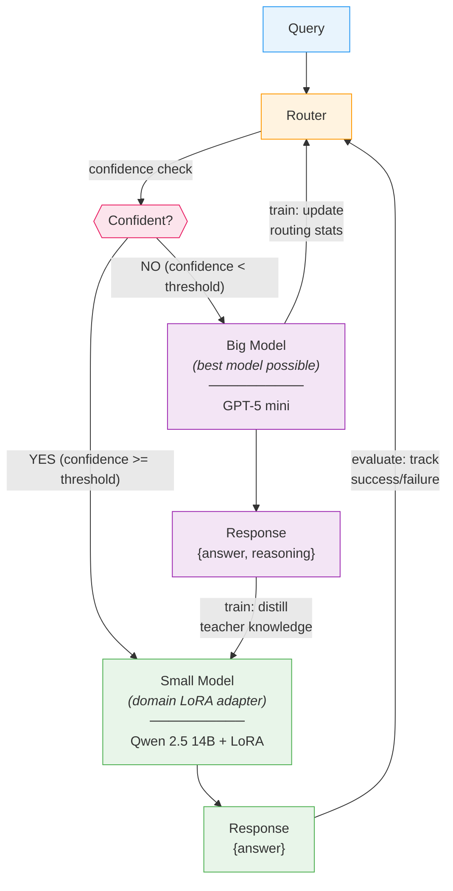
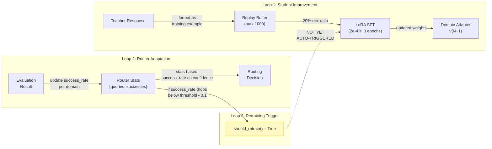

# Project Vision: Adaptive Teacher-Student Routing with Online Learning

## Core Research Question

> "When we route, why don't we use the answer from the large model to improve the smaller model?"

**The goal is domain-agnostic online distillation.** The small model learns from the large model's responses — not from ground truth labels, not from SQL execution, not from any dataset-specific oracle. Text-to-SQL (Spider, BIRD) is the test domain because it has convenient evaluation metrics, but the system must work for any domain where a larger model outperforms a smaller one.

---

## System Diagram



### Feedback Loops (the key insight)



---

## Phased Roadmap (from notes)

### Phase 1: Ground Truth Training (COMPLETED — validation only)
> "First, just use ground truth for training. If it succeeds, start with LLM."

**Purpose:** Validate that LoRA fine-tuning works at all. This is NOT the project's approach — it was a prerequisite sanity check before building the real system (teacher distillation).

| Task | Status | Evidence |
|------|--------|----------|
| Spider ground truth training | DONE | v4: 73.98% exec accuracy (+1.64% over base) |
| BIRD ground truth training | DONE | v1: 45.63% exec accuracy (+1.43% over base) |
| Cross-domain generalization test | DONE | BIRD LoRA on Spider: 70.21% (-2.13% regression) |
| Multi-domain adapters (math, code) | NOT STARTED | GSM8K + MBPP loaders exist, no training yet |

**Key result:** LoRA fine-tuning works. Small but consistent gains on both datasets. Domain specialization causes cross-domain regression, confirming the need for domain-specific routing. **Ground truth training is now done — the next phases are the actual project.**

### Phase 2: Cascading (Teacher Distillation) ← **YOU ARE HERE**
> "Then, try with cascading, then try to build an adaptive router (if possible)."

Route queries to the student first; if it fails, cascade to the teacher. **Use teacher responses to train the student.** This is the core of the project — the small model learns from the large model, not from labeled data.

| Task | Status | Evidence |
|------|--------|----------|
| Teacher model integration | DONE | GPT-5 mini via OpenAI Responses API |
| Training example collection | DONE | `framework.py:286-301` collects teacher responses |
| Replay buffer | DONE | `utils.py:217-273`, max 1000, domain-balanced eviction |
| Online training loop | PARTIAL | `trainer.py:165-209` exists but not auto-triggered |
| Automatic cascade pipeline | NOT DONE | Manual training only, no automatic loop |

### Phase 3: Adaptive Router
> "Try to build an adaptive router (if possible)."

Router that dynamically adjusts confidence thresholds based on student improvement.

| Task | Status | Evidence |
|------|--------|----------|
| Stats-based routing | DONE | Tracks success_rate, requires 10+ queries for trust |
| Perplexity-based routing | DONE | Converts student perplexity to confidence score |
| Self-eval routing (teacher judges) | DONE | Teacher rates query difficulty |
| Automatic threshold adaptation | NOT DONE | Threshold is static 0.7 |
| Retraining trigger | PARTIAL | `should_retrain()` exists but nothing calls it |
| ML-based router/classifier | NOT DONE | Placeholder only |

### Phase 4: Mathematical Framework & Analysis
> "Need mathematical proofs etc."

| Task | Status |
|------|--------|
| Cost-efficiency analysis (inference + training cost vs quality) | NOT DONE |
| Formal routing policy (when to cascade) | NOT DONE |
| Convergence guarantees for online learning | NOT DONE |
| Regret bounds for adaptive routing | NOT DONE |

---

## Open Research Questions (from notes)

### 1. Cost-Efficiency
> "Training also infers a cost, how much cost-efficient will the system be?"

**What to measure:**
- Cost per query: student (local GPU) vs teacher (API $)
- Training cost: GPU-hours per LoRA update
- Break-even point: after N teacher-trained queries, student handles them locally

**Current data points:**
- Student inference: free (local 4x RTX 6000 Ada)
- Teacher inference: GPT-5 mini API cost per query
- LoRA training: ~7000 samples trains in ~1 GPU-hour (estimated)
- Gain per training round: +1-2% accuracy

### 2. Is Domain-Specific Training Necessary?
> "I don't think/know data training is necessary for this task"

**Evidence so far:**
- Base Qwen 14B already gets 72.34% on Spider, 44.20% on BIRD
- LoRA adds +1.64% (Spider), +1.43% (BIRD) -- modest gains
- Question: Is prompt engineering + few-shot enough? Or does the gap widen on harder tasks?
- Experiment needed: Compare LoRA vs few-shot prompting vs teacher-augmented prompting

### 3. Online Training Strategy
> "How will the online training be done? (LoRA vs full fine-tuning)"

**Current choice:** LoRA (r=32, alpha=32) -- 4-bit quantized base, only adapter weights updated.

**Trade-offs:**
| Method | VRAM | Speed | Capacity | Forgetting Risk |
|--------|------|-------|----------|-----------------|
| LoRA (current) | ~24GB | Fast | Limited by rank | Low (small delta) |
| Full fine-tune | ~112GB+ | Slow | Full model | High |
| LoRA + replay (current) | ~24GB | Fast | Limited | Lower (20% mix) |
| Adapter merging | ~24GB | Medium | Stacks adapters | Medium |

### 4. Router Adaptation to Improving Student
> "How will the router adapt to the improving SLM?"

**Current gap:** Router stats are tracked but not used to dynamically adjust behavior.

**Proposed approaches:**
1. **Threshold decay:** Lower confidence threshold as student success_rate increases
2. **Periodic re-evaluation:** Run eval suite after each training round, update router
3. **Bandit formulation:** Treat routing as explore/exploit (Thompson sampling)
4. **Gradient-based:** Train small classifier on (query_features, routing_outcome) pairs

### 5. Multi-Turn Conversations
> "How would multi-turn work? (but not necessary in the first steps)"

**Deferred.** Current system is single-turn query-response. Multi-turn would require:
- Conversation state management
- Context window handling across turns
- Router decisions that consider conversation history

---

## Repository ↔ Vision Mapping

```
YOUR VISION                          CODEBASE
─────────────────────────────────────────────────────────
Query                          →     framework.process_query()
Router (adaptive)              →     src/router/router.py (4 strategies)
  confidence check             →       route() → RoutingDecision.confidence
  threshold                    →       config.router.confidence_threshold (0.7)
Small Model + LoRA             →     src/models/student.py (Qwen 2.5 14B)
  domain adapters              →       data/lora_adapters/{domain}/latest/
Big Model (as small as possible)→    src/models/teacher.py (GPT-5 mini)
Train: distill teacher → student →   training/trainer.py + utils.py replay buffer
Train: update router stats     →     router.update_stats()
Evaluate & feedback            →     src/evaluation/ (SQL executor, metrics)
```

---

## Current Scorecard

| Component | Maturity | Next Action |
|-----------|----------|-------------|
| Dataset loading (Spider, BIRD) | Production | Add GSM8K, MBPP training |
| Student model (Qwen 14B + LoRA) | Production | Experiment with rank, try QLoRA |
| Teacher model (GPT-5 mini) | Production | Measure per-query cost |
| Ground truth training | Validated | Train on more data, hyperparameter sweep |
| Evaluation pipeline | Production | Add difficulty-stratified metrics |
| Router (stats/perplexity/self_eval) | Prototype | Make adaptive, add auto-threshold |
| Online learning loop | Scaffolded | Wire up automatic cascade → train pipeline |
| Replay buffer | Implemented | Test catastrophic forgetting prevention |
| Cost analysis | Not started | Build cost tracking into framework |
| Mathematical framework | Not started | Literature review, formalize routing policy |

---

## Immediate Next Steps (Priority Order)

1. **Wire the cascade loop end-to-end**: Query → student tries → if uncertain, cascade to teacher → teacher response becomes training data → retrain student → router adapts. This is the core thesis. The student learns from the teacher, not from ground truth.
2. **Run teacher distillation experiment**: Collect teacher responses, train student on them, measure improvement. This validates that the small model can learn from the large model.
3. **Build cost tracking**: Log every inference (student/teacher) with latency + token count. Needed for cost-efficiency analysis.
4. **Adaptive threshold prototype**: After each training round, re-evaluate and adjust router threshold based on new success_rate.
5. **Expand to additional domains**: Demonstrate that the framework is domain-agnostic by testing on math reasoning and code generation — domains without convenient execution-based oracles.
6. **Formalize the research questions**: Write 1-page problem statement with notation for the routing policy, cost model, and learning dynamics.
